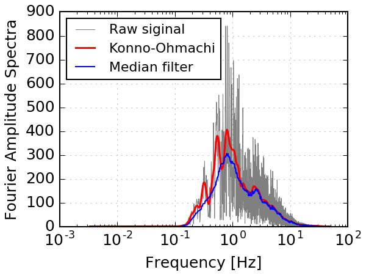

# _Fast_ Konno-Ohmachi

A Python library that performs Konno-Ohmachi spectral smoothing very fast (2x speedup compared to the "vanilla" Konno-Ohmachi smoothing algorithm).

## Background
Konno-Ohmachi is a smoothing algorithm proposed by Konno & Ohmachi (1998) [[abstract](http://bssa.geoscienceworld.org/content/88/1/228.short), [PDF](http://www.eq.db.shibaura-it.ac.jp/papers/Konno&Ohmachi1998.pdf)], which achieves a "uniform-span" smoothing to frequency spectra in the logarithmic scale.

For lower frequencies, the Konno-Ohmachi smoothing window is narrower (i.e., less smoothing), and for higher frequencies, the window is wider (i.e., more smoothing).

This makes the Konno-Ohmachi filter particularly appealing to seismologists, who often try to avoid over-smoothing lower frequencies (< 10 Hz) of seismic wave signals.

The plot below shows the result of Konno-Ohmachi filter versus a regular [median value filter](https://en.wikipedia.org/wiki/Median_filter). The two filters yield similar results for frequency > 5 Hz, but for lower frequencies, the median filter over-smoothes the original signal, which is undesirable.


#### (The raw signal used in this example is the Fourier amplitude spectrum of a ground acceleration waveform recorded during the [Magnitude-9.0 Tohoku-Oki Earthquake on March 11, 2011](https://en.wikipedia.org/wiki/2011_T%C5%8Dhoku_earthquake_and_tsunami).)

## Computation speed

Conventionally, Konno-Ohmachi filtering is time-consuming because its smoothing windows are different at each frequency and need to be calculated one by one.

This library achieves a 2x speedup by pre-calculating smoothing windows (i.e., trading memory space for speed).

It can speed up calculation even further by performing parallel computing (the `faster_konno_ohmachi()` function).

The only minor compromises in order to achieve the 2x speedup are:
- Only even integer smoothing strengths from 2 to 100 are supported. This is not an issue in reality because people rarely need non-integer smoothing strengths.
- The smoothing results from `fast_konno_ohmachi()` and `faster_konno_ohmachi()` are not entirely identical to the smoothing result from `slow_konno_ohmachi()` (the "vanilla" algorithm). However, the differences are too minor to have any practical implications.

## Installation

```bash
pip install fast-konno-ohmachi
```

## Usage

```python
import numpy as np
import fast_konno_ohmachi as fko

freq = np.arange(0, 2, 0.1)  # just an arbitrary example
signal = np.sin(freq)

smoothed = fko.fast_konno_ohmachi(signal, freq, smooth_coeff=40, progress_bar=True)
```

or (calculate in parallel)

```python
smoothed = fko.faster_konno_ohmachi(signal, freq, smooth_coeff=40, n_cores=4)
```

or (if you'd like to see how slow the "vanilla" implementation can be)

```python
smoothed = fko.slow_konno_ohmachi(signal, freq, smooth_coeff=40, progress_bar=True)
```

You can also try to run `demo/Demo_konno_ohmachi_smooth.py` to smooth a real-world signal. (You'd need `scipy` and `matplotlib` to run the demo script.)

## Additional notes on parallel computing

1. When using `faster_konno_ohmachi()`, the user should to protect the main script with `if __name__ == '__main__'` (see the demo script). This is **mandatory** for Windows, and **highly recommended** for Mac/Linux.
2. The `faster_konno_ohmachi()` function uses multiple CPU cores, but it is not necessarily faster than `fast_konno_ohmachi()`, because the data I/O between the CPU cores takes extra time ("computation overhead"). Below is a benchmarking of the running time for input signals with different length:

| Length of  signal (x1000) | 1    | 3    | 5    | 7    | 9    | 11   | 13   | 15   | 17   | 19   | 21   | 23   | 25   | 27   | 29   | 31   |
| ------------------------- | ---- | ---- | ---- | ---- | ---- | ---- | ---- | ---- | ---- | ---- | ---- | ---- | ---- | ---- | ---- | ---- |
| Time of "fast" (sec)      | 0.1  | 0.4  | 0.9  | 1.5  | 2.2  | 3.3  | 4.4  | 5.4  | 6.8  | 8.1  | 9.6  | 11.2 | 13.1 | 14.9 | 16.7 | 18.8 |
| Time of "faster" (sec)    | 2.4  | 2.4  | 2.8  | 3.0  | 3.3  | 3.9  | 4.1  | 4.6  | 4.9  | 5.5  | 5.8  | 6.7  | 7.5  | 8.2  | 9.0  | 9.8  |


Or as shown in this figure:


